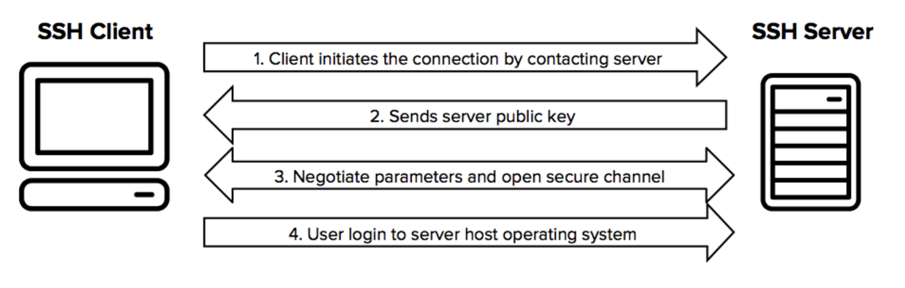
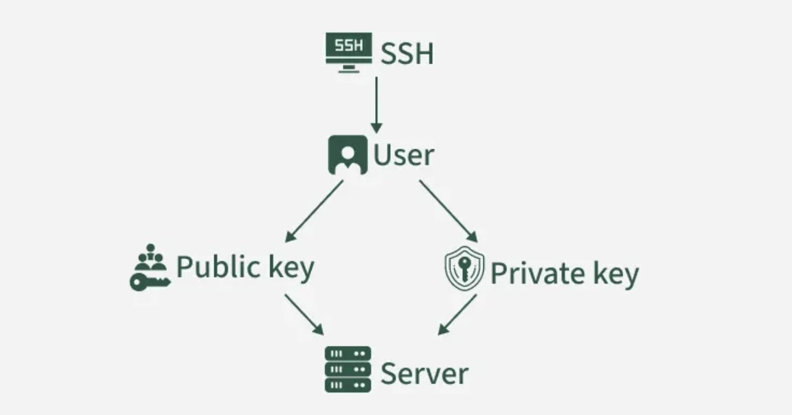
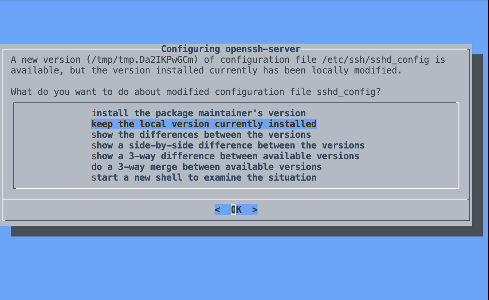

# Overview

Before starting this tutorial, you’ll set up **SSH (Secure Shell)** on your computer or in GitHub Codespaces.  
SSH lets you securely connect to another machine, execute commands remotely, and transfer files.

You will learn how to:

- generate your first SSH key pair  
- test SSH connections (Codespaces or local machine)  
- understand how SSH works  
- optionally connect to lxplus or Fermilab LPC  

This setup ensures you’re ready for the hands-on SSH lessons that follow.

---

# 1. Generate an SSH Key

SSH uses **asymmetric cryptography** — a *public key* you can share and a *private key* that must remain secret.

Create your key pair:

```bash
ssh-keygen -t ed25519 -C "your_email@example.com"
````

If `ed25519` is not available:

```bash
ssh-keygen -t rsa -b 4096 -C "your_email@example.com"
```

Your keys will be created in:

```
~/.ssh/id_ed25519      # private key (keep safe!)
~/.ssh/id_ed25519.pub  # public key (share with servers)
```

---

# 2. How SSH Works

These diagrams illustrate core SSH concepts.

### SSH Connection Handshake



### Public/Private Key Authentication



---

# 3. Test an SSH Connection (General Form)

```bash
ssh username@servername
```

Example for CERN:

```bash
ssh username@lxplus.cern.ch
```

On first connection:

```
Are you sure you want to continue connecting (yes/no)? yes
```

---

# 4. Using SSH Inside GitHub Codespaces (Highly Recommended)

GitHub Codespaces provides a complete Linux environment in the cloud that already includes the **SSH client**.
However, **the SSH server (sshd) is not running by default**, so localhost SSH will fail unless you activate it.

Codespaces is the ideal environment for practicing SSH commands even if you lack access to lxplus or Fermilab.

---

The following steps assume you already have a Codespace running. If you haven’t created one yet, follow the instructions here: [Creating a codespace for a repository](https://docs.github.com/en/codespaces/developing-in-a-codespace/creating-a-codespace-for-a-repository)

## Step 1 — Install & Start the SSH Server. ssh-keygen -t ed25519

```
sudo apt-get update && sudo apt-get install -y openssh-server
```

After running the previous command you should see something similar to this



select "keep the local version currently installed" and press enter.

Next, run the following commands,

```
sudo mkdir -p /run/sshd
sudo service ssh start
```

You should see something like this

```* Starting OpenBSD Secure Shell server sshd```

---

## Step 2 — Add your public key to authorized_keys

If you already generated your SSH key:

```
ssh-keygen -t ed25519
```

This will generate your public/private key pair. You can press the return key three times to the questions asked.

Add the public key so SSH can authenticate you:

```bash
mkdir -p ~/.ssh
cat ~/.ssh/id_ed25519.pub >> ~/.ssh/authorized_keys
chmod 700 ~/.ssh
chmod 600 ~/.ssh/authorized_keys
```

---

## Step 3 — Determine the SSH Port (often 2222)

```bash
ss -ltnp
```

Look for a line such as:

```
LISTEN ... 0.0.0.0:2222
```

Use this port to connect.

---

## Step 4 — SSH Into Your Codespace (Remote Session Inside Codespaces)

```bash
ssh -p 2222 "$(whoami)"@localhost -t bash
```

You will be asked "Are you sure you want to continue connecting (yes/no/[fingerprint])?" make sure to answer *yes*

---

## Step 5 — Verify You’re Inside the SSH Session

Inside the session, run:

```bash
echo "USER: $(whoami)"
echo "HOST: $(hostname)"
echo "SSH:  $SSH_CONNECTION"
pwd
```

Expected:

```
USER: codespace
HOST: <codespaces-ID>
SSH: <connection info>
/home/codespace
```

To exit, run:

```bash
exit
```

Expected:

```Connection to localhost closed.```

---

## Step 6 — Add an SSH Alias (Optional)

```bash
nano ~/.ssh/config
```

Add:

```
Host localcodespace
    HostName localhost
    User codespace
    Port 2222
    RequestTTY force
    RemoteCommand bash
```

Use it:

```bash
ssh localcodespace
```

---

# 5. Using SSH Locally (macOS, Linux, Windows)

If you’re not using Codespaces, you can still practice SSH using **localhost** (`ssh into your own machine`).

---

## macOS

Enable:

```
sudo systemsetup -setremotelogin on
```

Connect:

```
ssh $(whoami)@localhost
```

Disable (optional):

```
sudo systemsetup -setremotelogin off
```

---

## Linux

Install & start:

```bash
sudo apt install openssh-server
sudo systemctl enable ssh
sudo systemctl start ssh
```

Test:

```
ssh $(whoami)@localhost
```

---

## Windows (PowerShell)

1. Install *OpenSSH Client* and *OpenSSH Server* in
   **Settings → Apps → Optional Features**
2. Start service:

```powershell
Start-Service sshd
Set-Service -Name sshd -StartupType Automatic
```

SSH into yourself:

```powershell
ssh localhost
```

---

# 6. (Optional) Connecting to CERN or Fermilab

These steps apply only if you belong to CMS or another collaboration.

### CERN (lxplus)

* Request account:
  [https://twiki.cern.ch/twiki/bin/view/CMSPublic/WorkBookGetAccount](https://twiki.cern.ch/twiki/bin/view/CMSPublic/WorkBookGetAccount)
* Connect:

  ```bash
  ssh username@lxplus.cern.ch
  ```

### Fermilab LPC (US-CMS)

* Request account:
  [http://www.uscms.org/uscms_at_work/computing/getstarted/getaccount_fermilab.shtml](http://www.uscms.org/uscms_at_work/computing/getstarted/getaccount_fermilab.shtml)
* Connect:

  ```bash
  ssh username@cmslpc-el8.fnal.gov
  ```


---

# 8. Common Issues and Fixes

| Problem                            | Solution                                             |
| ---------------------------------- | ---------------------------------------------------- |
| Permission denied (publickey)      | Check key permissions, upload your key to the server |
| Host key verification failed       | `ssh-keygen -R servername`                           |
| Connection timed out               | Ensure internet/VPN is working                       |
| Key not found                      | `chmod 600 ~/.ssh/id_ed25519`                        |
| Cannot ssh localhost in Codespaces | Ensure sshd is running and check which port it uses  |

---

# You’re Ready!

You now have a working SSH setup that allows you to:

- generate and manage SSH keys
- log in to remote servers
- practice SSH anywhere using Codespaces

Proceed to the next lesson: **“Introduction to SSH”**.

---

<p style="font-size:11px; color:#888;">
Page improvements by Iliomar Rodríguez-Ramos.
</p>

